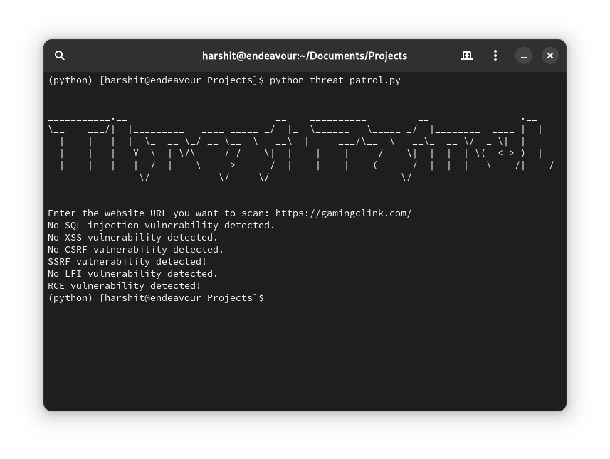

# Threat-Patrol
Threat-Patrol is a simple Python script that can scan a website for potential vulnerabilities such as SQL injection, XSS, CSRF, SSRF, LFI and RCE. It is a lightweight, easy to use tool for web application security testing as it can quickly detect vulnerabilities.

## Features

- Easy to Use
- Instant results
- Automatically scans a website for vulnerability
- Provides a simple command line interface

## Usage

Clone Threat-Patrol repository
```
git clone https://github.com/itsraiharshit/threat-patrol
```
Navigate to Threat-Patrol folder
```
cd threat-patrol
```
Install requests module via pip
```
pip3 install requests
```
Run the script
```
python threat-patrol.py
```


#### Warning
Enter the complete URL of the website, not only domain name else it will throw an error.
